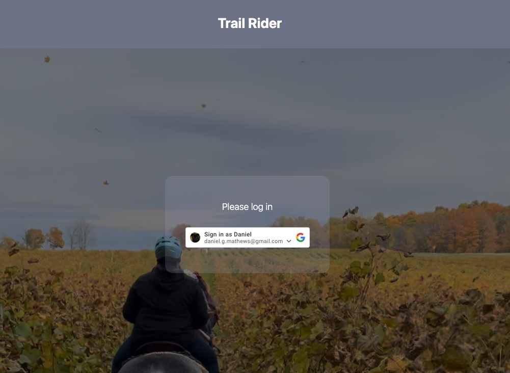
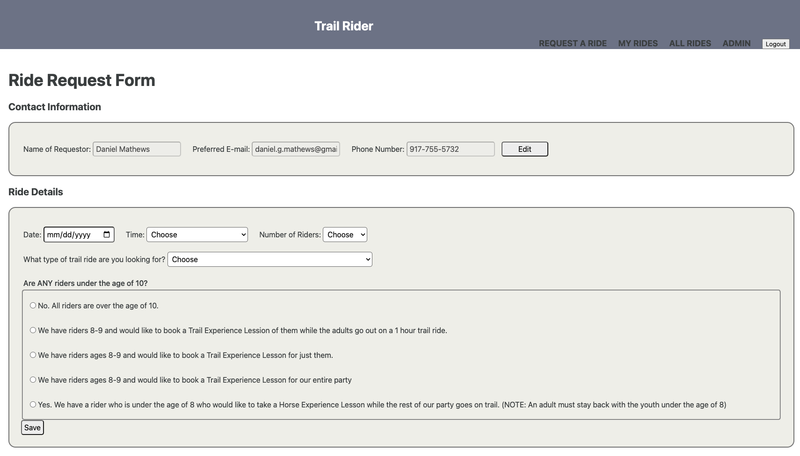

# Trail Rider: Find Your Place on a Horse

# [Use Trail Rider Here](https://trail-rider.fly.dev/)

# Background

Trail Rider is a web-based platform for connecting newcomers and veteran riders with a barn that can curate an adventure for them out on trail.
Many barn owners are in business out of a passion for horses and for sharing that experience with others. Profit margins in the industry are slim and barn staff have busy lives tending to animals day and night.  Trail Rider offers an automated solution to scheduling and managing communications with visitors, simplifying the effort on behalf of barn staff and cutting down delays in communication.

Planning materials can be found [here](https://trello.com/b/0rCPyo9P/trail-rider).

# Technologies used
* JavaScript
* Node.js
* Express
* Mongoose
* MongoDB
* Google OAth
* HTML
* CSS
* Git
* EJS

# Attributions
My sincere thanks to the creators who have made their content available to be freely used by developers.

Trail Rider makes use of the font Poppins designed by Indian Type Foundry and made available through Google fonts.  It can be accessed at [google fonts](https://fonts.google.com/specimen/Poppins?query=poppins).

Trail Rider uses a favicon made available by Freepik, which can be found [here](https://www.flaticon.com/free-icon/black-head-horse-side-view-with-horsehair_32904).

# Ice Box
- Optimize views for mobile devices
- Implement automated emails to staff upon new request
- Implement automated emails to clients upon confirmation of scheduling
- Add archive view for appointments in the past
- Introduce automation for pre-selecting an appropriate horse for each guest based on height and weight
- Output weekly schedule of all appointments
